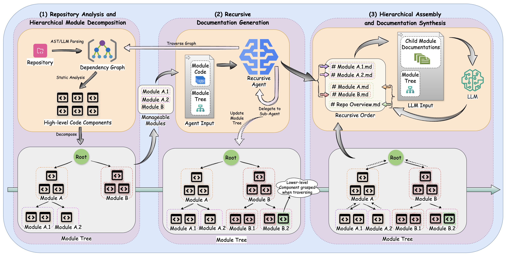

<h1 align="center">CodeWiki: Evaluating AI's Ability to Generate Holistic Documentation for Large-Scale Codebases</h1>

<p align="center">
  <strong>AI-Powered Repository Documentation Generation</strong> • <strong>Multi-Language Support</strong> • <strong>Architecture-Aware Analysis</strong>
</p>

<p align="center">
  Generate holistic, structured documentation for large-scale codebases • Cross-module interactions • Visual artifacts and diagrams
</p>

<p align="center">
  <a href="https://python.org/"></a>
  <a href="./LICENSE"></a>
  <a href="https://github.com/FSoft-AI4Code/CodeWiki/stargazers"></a>
  <a href="https://arxiv.org/abs/2510.24428"></a>
</p>

<p align="center">
  <a href="#quick-start"><strong>Quick Start</strong></a> •
  <a href="#cli-commands"><strong>CLI Commands</strong></a> •
  <a href="#documentation-output"><strong>Output Structure</strong></a> •
  <a href="https://arxiv.org/abs/2510.24428"><strong>Paper</strong></a>
</p>

<p align="center">
  
</p>

---

## Quick Start

### 1. Install CodeWiki

```bash
# Minimal install for CLI + static analysis + IDE Bridge mode
pip install git+https://github.com/613lys/codewiki.git

# Optional: install everything
pip install "codewiki[all] @ git+https://github.com/613lys/codewiki.git"

# Verify installation
codewiki --version
```

### 2. Configure Your Environment

CodeWiki supports **IDE Bridge** mode for AI IDE workflows without API dependencies. CodeWiki writes LLM tasks to local files, and your AI IDE completes those tasks by writing matching result files.

```bash
# IDE Bridge mode (no API key; complete generated task files in your AI IDE)
codewiki config set --provider ide-bridge
```

### 3. Generate Documentation

```bash
# Navigate to your project
cd /path/to/your/project

# Generate documentation
codewiki generate

# Generate with HTML viewer for GitHub Pages
codewiki generate --github-pages --create-branch
```

**That's it!** Your documentation will be generated in `./docs/` with comprehensive repository-level analysis.

### 4. Run with an AI IDE Agent

If you are using Windsurf or another AI IDE, run CodeWiki in agent batch mode. CodeWiki will create task files under `docs_windsurf/.codewiki/ide_bridge/`, wait for the AI IDE to write result files, then continue when you rerun the same command.

For a Java project, a good starting command is:

```powershell
codewiki generate `
  --output docs_windsurf `
  --include "*.java,*.xml,*.yml,*.yaml,*.properties,*.sql,*.html,*.css,*.ts" `
  --exclude "target/**,build/**,.gradle/**,.mvn/**,node_modules/**,dist/**,out/**" `
  --max-depth 2 `
  --max-token-per-module 25000 `
  --max-token-per-leaf-module 12000 `
  --doc-type architecture `
  --agent-json `
  --verbose
```

Use this as the startup prompt for the AI IDE agent:

```text
You are running CodeWiki in agent batch mode.

Run the provided `codewiki generate` command.

After each run, inspect:

<output>/.codewiki/ide_bridge/pending_tasks.json

Follow the JSON protocol exactly:

1. If `status` is `complete`, stop. Do not generate more task results.

2. If `status` is `pending`, read `agent_prompt`, `rerun_command`, and `tasks`.

3. If `selection_required` is true, ask the user which task indexes to complete before writing any result files. Accept:
   - `all`
   - a single number, e.g. `4`
   - a range, e.g. `1-3`
   - a comma-separated selection, e.g. `1,3,5-7`

4. Complete only the selected task indexes. If `selection_required` is false, complete task `1`.

5. For each selected task:
   - Read `task_path`.
   - Read referenced repository source files directly from the workspace.
   - Follow the task file's prompt and output contract.
   - Write the exact required response to `result_path`.

6. Rerun `rerun_command`.

Repeat until `pending_tasks.json` reports `status: complete`.

Important:
- Do not treat the task file as the only source of truth; read referenced source files directly.
- Do not write chat explanations into result files.
- Preserve required wrapper tags such as `<GROUPED_COMPONENTS>`, `<SUB_MODULES>`, or `<OVERVIEW>` when requested.
- For markdown documentation tasks, write only the final markdown document.
```

### Usage Example


---

## What is CodeWiki?

CodeWiki is an open-source framework for **automated repository-level documentation** across eight programming languages. It generates holistic, architecture-aware documentation that captures not only individual functions but also their cross-file, cross-module, and system-level interactions.

### Key Innovations

| Innovation | Description | Impact |
|------------|-------------|--------|
| **Hierarchical Decomposition** | Dynamic programming-inspired strategy that preserves architectural context | Handles codebases of arbitrary size (86K-1.4M LOC tested) |
| **Recursive Agentic System** | Adaptive multi-agent processing with dynamic delegation capabilities | Maintains quality while scaling to repository-level scope |
| **Multi-Modal Synthesis** | Generates textual documentation, architecture diagrams, data flows, and sequence diagrams | Comprehensive understanding from multiple perspectives |

### Supported Languages

**🐍 Python** • **☕ Java** • **🟨 JavaScript** • **🔷 TypeScript** • **⚙️ C** • **🔧 C++** • **🪟 C#** • **🎯 Kotlin**

---

## CLI Commands

### Configuration Management

```bash
# Use IDE Bridge mode
codewiki config set --provider ide-bridge

# Configure max token settings
codewiki config set --max-tokens 32768 --max-token-per-module 36369 --max-token-per-leaf-module 16000

# Configure max depth for hierarchical decomposition
codewiki config set --max-depth 3

# Show current configuration
codewiki config show

# Validate your configuration
codewiki config validate
```

### Documentation Generation

```bash
# Basic generation
codewiki generate

# Custom output directory
codewiki generate --output ./documentation

# Create git branch for documentation
codewiki generate --create-branch

# Generate HTML viewer for GitHub Pages
codewiki generate --github-pages

# Enable verbose logging
codewiki generate --verbose

# Full-featured generation
codewiki generate --create-branch --github-pages --verbose

# Incremental update (only regenerate changed modules since last run)
codewiki generate --update
```

### Customization Options

CodeWiki supports customization for language-specific projects and documentation styles:

```bash
# C# project: only analyze .cs files, exclude test directories
codewiki generate --include "*.cs" --exclude "Tests,Specs,*.test.cs"

# Focus on specific modules with architecture-style docs
codewiki generate --focus "src/core,src/api" --doc-type architecture

# Add custom instructions for the AI agent
codewiki generate --instructions "Focus on public APIs and include usage examples"
```

#### Pattern Behavior (Important!)

- **`--include`**: When specified, **ONLY** these patterns are used (replaces defaults completely)
  - Example: `--include "*.cs"` will analyze ONLY `.cs` files
  - If omitted, all supported file types are analyzed
  - Supports glob patterns: `*.py`, `src/**/*.ts`, `*.{js,jsx}`
  
- **`--exclude`**: When specified, patterns are **MERGED** with default ignore patterns
  - Example: `--exclude "Tests,Specs"` will exclude these directories AND still exclude `.git`, `__pycache__`, `node_modules`, etc.
  - Default patterns include: `.git`, `node_modules`, `__pycache__`, `*.pyc`, `bin/`, `dist/`, and many more
  - Supports multiple formats:
    - Exact names: `Tests`, `.env`, `config.local`
    - Glob patterns: `*.test.js`, `*_test.py`, `*.min.*`
    - Directory patterns: `build/`, `dist/`, `coverage/`

#### Setting Persistent Defaults

Save your preferred settings as defaults:

```bash
# Set include patterns for C# projects
codewiki config agent --include "*.cs"

# Exclude test projects by default (merged with default excludes)
codewiki config agent --exclude "Tests,Specs,*.test.cs"

# Set focus modules
codewiki config agent --focus "src/core,src/api"

# Set default documentation type
codewiki config agent --doc-type architecture

# View current agent settings
codewiki config agent

# Clear all agent settings
codewiki config agent --clear
```

| Option | Description | Behavior | Example |
|--------|-------------|----------|---------|
| `--include` | File patterns to include | **Replaces** defaults | `*.cs`, `*.py`, `src/**/*.ts` |
| `--exclude` | Patterns to exclude | **Merges** with defaults | `Tests,Specs`, `*.test.js`, `build/` |
| `--focus` | Modules to document in detail | Standalone option | `src/core,src/api` |
| `--doc-type` | Documentation style | Standalone option | `api`, `architecture`, `user-guide`, `developer` |
| `--instructions` | Custom agent instructions | Standalone option | Free-form text |

### Token Settings

CodeWiki allows you to configure maximum token limits for LLM calls. This is useful for:
- Adapting to different model context windows
- Controlling costs by limiting response sizes
- Optimizing for faster response times

```bash
# Set max tokens for LLM responses (default: 32768)
codewiki config set --max-tokens 16384

# Set max tokens for module clustering (default: 36369)
codewiki config set --max-token-per-module 40000

# Set max tokens for leaf modules (default: 16000)
codewiki config set --max-token-per-leaf-module 20000

# Set max depth for hierarchical decomposition (default: 2)
codewiki config set --max-depth 3

# Override at runtime for a single generation
codewiki generate --max-tokens 16384 --max-token-per-module 40000 --max-depth 3
```

| Option | Description | Default |
|--------|-------------|---------|
| `--max-tokens` | Maximum output tokens for LLM response | 32768 |
| `--max-token-per-module` | Input tokens threshold for module clustering | 36369 |
| `--max-token-per-leaf-module` | Input tokens threshold for leaf modules | 16000 |
| `--max-depth` | Maximum depth for hierarchical decomposition | 2 |

### Configuration Storage

- **Settings & Agent Instructions**: `~/.codewiki/config.json`
- **Credentials**: Not used. This build only supports IDE Bridge task files.

---

## Documentation Output

Generated documentation includes both **textual descriptions** and **visual artifacts** for comprehensive understanding.

### Textual Documentation
- Repository overview with architecture guide
- Module-level documentation with API references
- Usage examples and implementation patterns
- Cross-module interaction analysis

### Visual Artifacts
- System architecture diagrams (Mermaid)
- Data flow visualizations
- Dependency graphs and module relationships
- Sequence diagrams for complex interactions

### Output Structure

```
./docs/
├── overview.md              # Repository overview (start here!)
├── module1.md               # Module documentation
├── module2.md               # Additional modules...
├── module_tree.json         # Hierarchical module structure
├── first_module_tree.json   # Initial clustering result
├── metadata.json            # Generation metadata
└── index.html               # Interactive viewer (with --github-pages)
```

---

## Experimental Results

CodeWiki has been evaluated on **CodeWikiBench**, the first benchmark specifically designed for repository-level documentation quality assessment.

### Performance by Language Category

| Language Category | CodeWiki (Sonnet-4) | DeepWiki | Improvement |
|-------------------|---------------------|----------|-------------|
| High-Level (Python, JS, TS) | **79.14%** | 68.67% | **+10.47%** |
| Managed (C#, Java) | **68.84%** | 64.80% | **+4.04%** |
| Systems (C, C++) | 53.24% | 56.39% | -3.15% |
| **Overall Average** | **68.79%** | **64.06%** | **+4.73%** |

### Results on Representative Repositories

| Repository | Language | LOC | CodeWiki-Sonnet-4 | DeepWiki | Improvement |
|------------|----------|-----|-------------------|----------|-------------|
| All-Hands-AI--OpenHands | Python | 229K | **82.45%** | 73.04% | **+9.41%** |
| puppeteer--puppeteer | TypeScript | 136K | **83.00%** | 64.46% | **+18.54%** |
| sveltejs--svelte | JavaScript | 125K | **71.96%** | 68.51% | **+3.45%** |
| Unity-Technologies--ml-agents | C# | 86K | **79.78%** | 74.80% | **+4.98%** |
| elastic--logstash | Java | 117K | **57.90%** | 54.80% | **+3.10%** |

**View comprehensive results:** See [paper](https://arxiv.org/abs/2510.24428) for complete evaluation on 21 repositories spanning all supported languages.

---

## How It Works

### Architecture Overview

CodeWiki employs a three-stage process for comprehensive documentation generation:

1. **Hierarchical Decomposition**: Uses dynamic programming-inspired algorithms to partition repositories into coherent modules while preserving architectural context across multiple granularity levels.

2. **Recursive Multi-Agent Processing**: Implements adaptive multi-agent processing with dynamic task delegation, allowing the system to handle complex modules at scale while maintaining quality.

3. **Multi-Modal Synthesis**: Integrates textual descriptions with visual artifacts including architecture diagrams, data-flow representations, and sequence diagrams for comprehensive understanding.

### Data Flow

```
┌─────────────────┐    ┌──────────────────┐    ┌─────────────────┐
│   Codebase      │───▶│  Hierarchical    │───▶│  Multi-Agent    │
│   Analysis      │    │  Decomposition   │    │  Processing     │
└─────────────────┘    └──────────────────┘    └─────────────────┘
                                │                        │
                                ▼                        ▼
┌─────────────────┐    ┌──────────────────┐    ┌─────────────────┐
│   Visual        │◀───│  Multi-Modal     │◀───│  Structured     │
│   Artifacts     │    │  Synthesis       │    │  Content        │
└─────────────────┘    └──────────────────┘    └─────────────────┘
```

---

## Requirements

- **Python 3.11+**
- **Node.js** (for Mermaid diagram validation)
- **AI IDE / agent access** for completing IDE Bridge task files
- **Git** (for branch creation features)

---

## Additional Resources

### Documentation & Guides
- **[MCP Server](codewiki/mcp/)** - Model Context Protocol server for IDE integrations
- **[Docker Deployment](docker/DOCKER_README.md)** - Containerized deployment instructions
- **[Development Guide](DEVELOPMENT.md)** - Project structure, architecture, and contributing guidelines
- **[CodeWikiBench](https://github.com/FSoft-AI4Code/CodeWikiBench)** - Repository-level documentation benchmark
- **[Live Demo](https://fsoft-ai4code.github.io/codewiki-demo/)** - Interactive demo and examples

### Academic Resources
- **[Paper](https://arxiv.org/abs/2510.24428)** - Full research paper with detailed methodology and results
- **[Citation](#citation)** - How to cite CodeWiki in your research

---

## Citation

If you use CodeWiki in your research, please cite:

```bibtex
@misc{hoang2025codewikievaluatingaisability,
      title={CodeWiki: Evaluating AI's Ability to Generate Holistic Documentation for Large-Scale Codebases},
      author={Anh Nguyen Hoang and Minh Le-Anh and Bach Le and Nghi D. Q. Bui},
      year={2025},
      eprint={2510.24428},
      archivePrefix={arXiv},
      primaryClass={cs.SE},
      url={https://arxiv.org/abs/2510.24428},
}
```

---

## Star History

<p align="center">
  <a href="https://star-history.com/#FSoft-AI4Code/CodeWiki&Date">
   <picture>
     <source media="(prefers-color-scheme: dark)" srcset="https://api.star-history.com/svg?repos=FSoft-AI4Code/CodeWiki&type=Date&theme=dark" />
     <source media="(prefers-color-scheme: light)" srcset="https://api.star-history.com/svg?repos=FSoft-AI4Code/CodeWiki&type=Date" />
     
   </picture>
  </a>
</p>

---

## License

This project is licensed under the MIT License.
